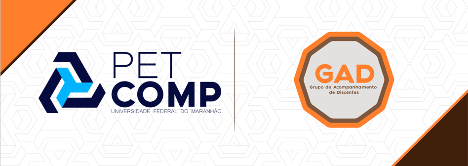

# Monitoria_LP

Esse repositório foi criado pelo Grupo de Acompanhamento de Discentes (GAD), composto por membros do [Programa de Educação Tutorial de Ciência da Computação da UFMA](https://pet.ufma.br/comp/) (Universidade Federal do Maranhão). Nesses exercícios, usamos a [linguagem de Programação C](http://www.open-std.org/jtc1/sc22/wg14/), seguindo os padrões ISO/IEC 9899:2011. Aqui estão armazenados os exercícios resolvidos, a fim de ajudar os discentes que estão cursando a disciplina de Linguagem de Programação, ministrado no curso de Ciência da Computação na UFMA. 

### Licença

Respeite a licença de software livre aqui vigente [(GNU General Public License v3.0)](/LICENSE). Você, jovem padawan, fique a vontade para responder e copiar os exercícios aqui listados; Já aos Mestres Jedi, esperamos que o nosso material renda bons frutos para as suas aulas. Assim, pedimos para que sempre referencie esse mesmo repositório, a fim de divulgar essa e futuras contribuições do PETComp, especialmente para a comunidade acadêmica de computação.
